## Learning intra-modal and cross-modal embeddings

This repo is an implementation of the paper [Objects that sound](https://arxiv.org/abs/1712.06651). It learns suitable embeddings from unlabelled audio and video pairs which can be used for both intra-modal (image-2-image or audio-2-audio) or cross-modal (image-2-audio or audio-2-image) query retrieval. This is done by training a tailored network (AVENet) for the audio-visual correspondence task. 

### Dataset and dataloader

We used the [Audioset dataset](https://research.google.com/audioset/download.html) to train and evaluate our model. Due to resource constraints, we chose a subset of 50 classes from all the possible classes. The classes are:
> Accordion, Acoustic guitar, Bagpipes, Banjo, Bass drum, Bell, Church
> bell, Bicycle bell, Bugle. Cello, Chant, Child singing, Chime, Choir,
> Clarinet, Cowbell, Cymbal, Dental drill, Dentist’s drill, Drill, Drum,
> Drum kit, Electric guitar, Electric piano, Electronic organ, Female singing,
> Filing (rasp), Flute, French horn, Gong, Guitar, Hammer, Harmon-
> ica, Harp, Jackhammer, Keyboard (musical), Male singing, Mandolin,
> Marimba, xylophone, Musical ensemble, Orchestra, Piano, Power tool,
> Sanding, Sawing, Saxophone, Sitar, Tabla, Trumpet, Tuning fork, Wind
> chime

There are _165865_ videos to download. We downloaded a subset of ~46k videos (40k train, 3k validation, 3k test). The dataset was highly skewed. Here is a distribution of all the videos across all classes among the 40k videos. 

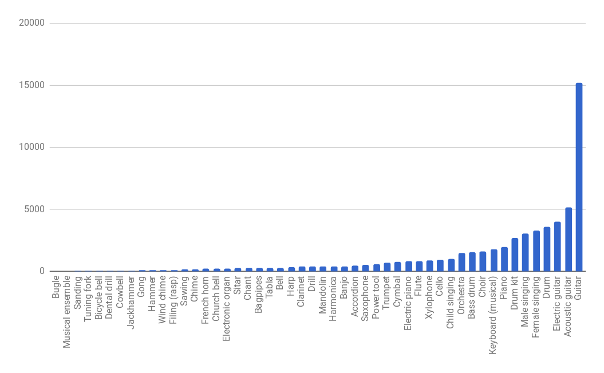

This was potentially bad because one class will be learnt very well, and the others would be just classified as random. As it turns out, the training procedure is such that it is quite robust with respect to points which have low fractions in the training data. 
Some problems with the dataset are: 
- Many of the videos were less than 10 seconds in length. They have been handled in the dataloader by sampling from only the frames available.
- Some videos had no or poor quality audio and didn't have relevant frames (blank screen and guitar playing, or just an album cover and the instruments playing in the audio).
- Some of the videos had too many classes associated with them which result in a lot of noise. For example, a video with the sound of bells also had the sound of a human shouting in the background. In such cases, we cant really distinguish between the sounds and hence such examples make training difficult.
- The distribution over classes is highly skewed (check above).
- Also even inside the same class, there were many videos with extremely different audio samples, that even humans couldn't classify as same or different.

### Spectrogram analysis
Looking at the log spectrograms of different classes, we do see some subtle differences between the different classes. For example, electric organ has big incisions into high frequency across time, dental drill almost covers all frequencies, chanting can be seen to have a periodic repetition in frequency pattern.

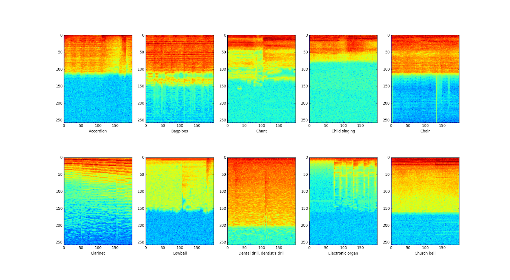

### Training
The training is performed using the parameters and implementational details mentioned in [the paper](https://arxiv.org/abs/1712.06651). It took us ~3 days to train it. Here is the training plot:

The accuracy, however is just a proxy for learning good representations of the audio and video frames. As we see later, we get some good results and some unexpected robustness. 
*Note*: We DO NOT use the labels of the videos in any way during training, and only use them for evaluation. That means, that the network is able to semantically correlate the audio with the instruments, which was the ultimate purpose of training with the given constraints. The representations are learnt using an unsupervised method, which make the results interesting, and this method ensures faster query retrieval.

### Results
#### Image to image retrieval
We select a random frame from a video as a query image, and then check the Euclidean distance between the two representation vectors and select the top 5 among them. Since the top match will always be the query image itself, we show the top 4 excluding the query. Also, some of the queries have frames close to each other, so some results may be redundant. 

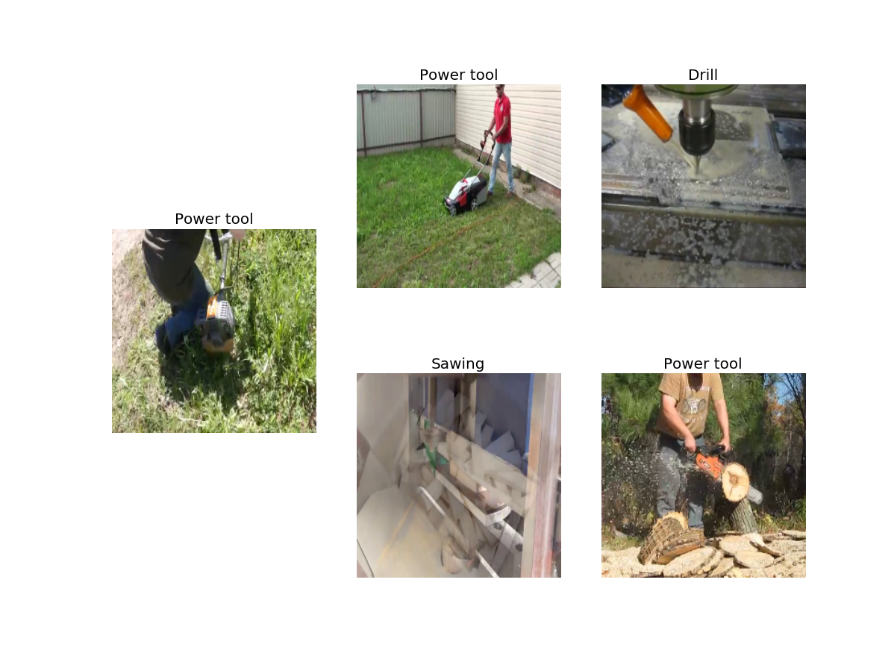
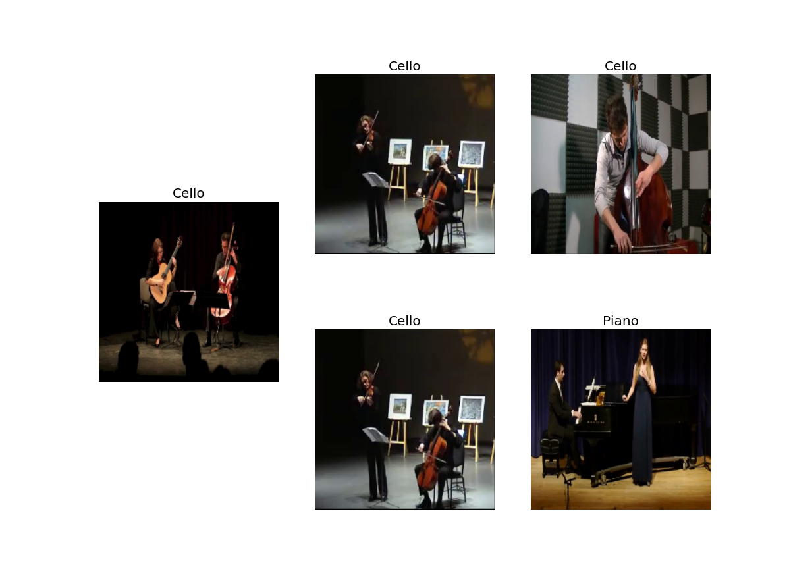
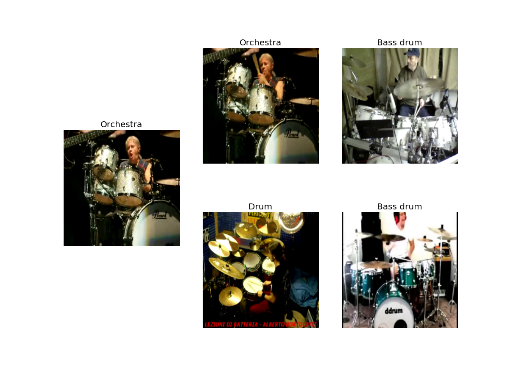

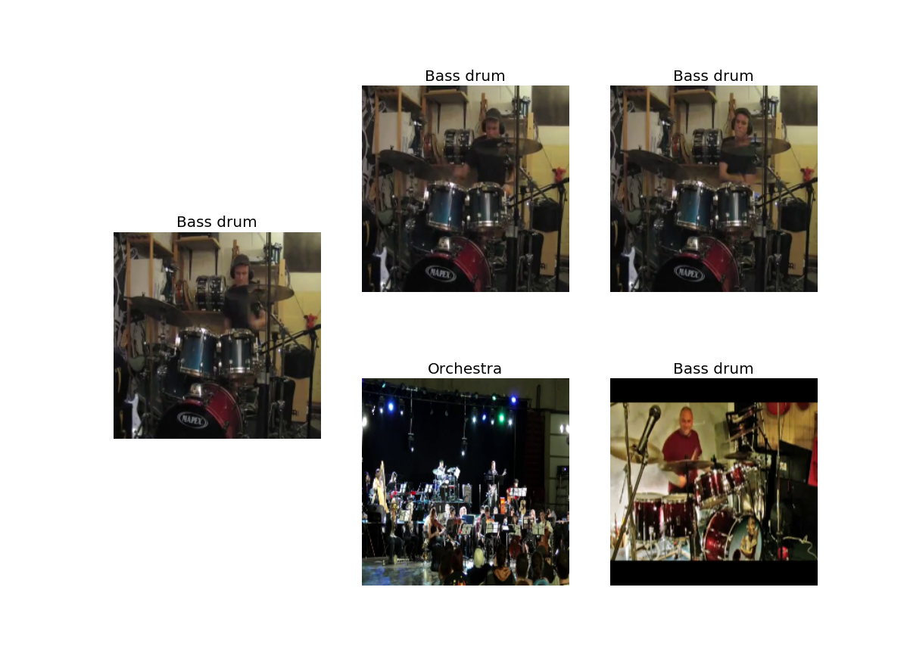

#### Audio to image retrieval
We select a random 1-second audio clip from the video, and find its distance between the video embeddings. A random frame from the video of the query audio is also shown. Note that the video contains multiple classes, and the plots show only one of them. Hence, we attach the audio as well for manual analysis.

<audio src="./assets/sounds/0.wav" controls preload></audio>
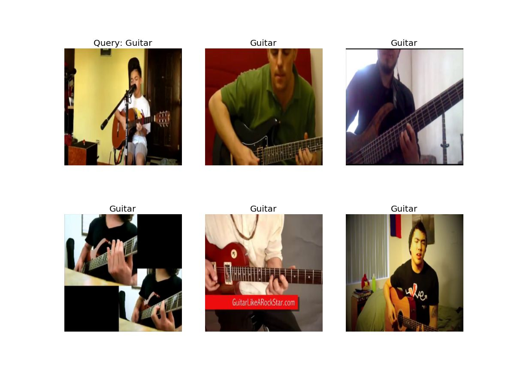
<audio src="./assets/sounds/1.wav" controls preload></audio>

<audio src="./assets/sounds/2.wav" controls preload></audio>
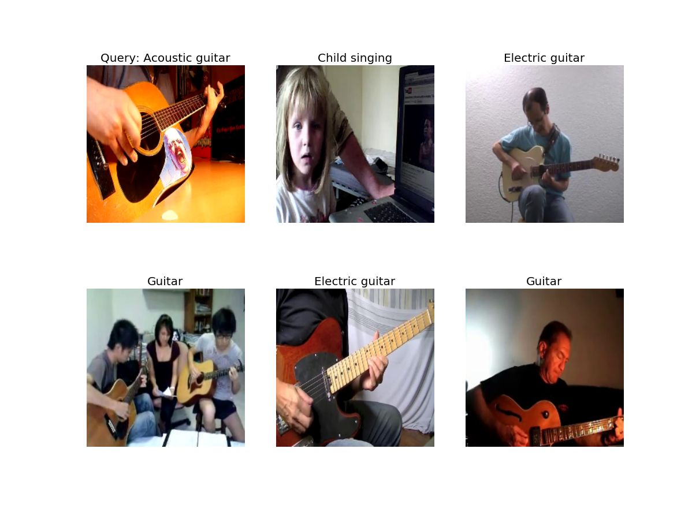
<audio src="./assets/sounds/3.wav" controls preload></audio>
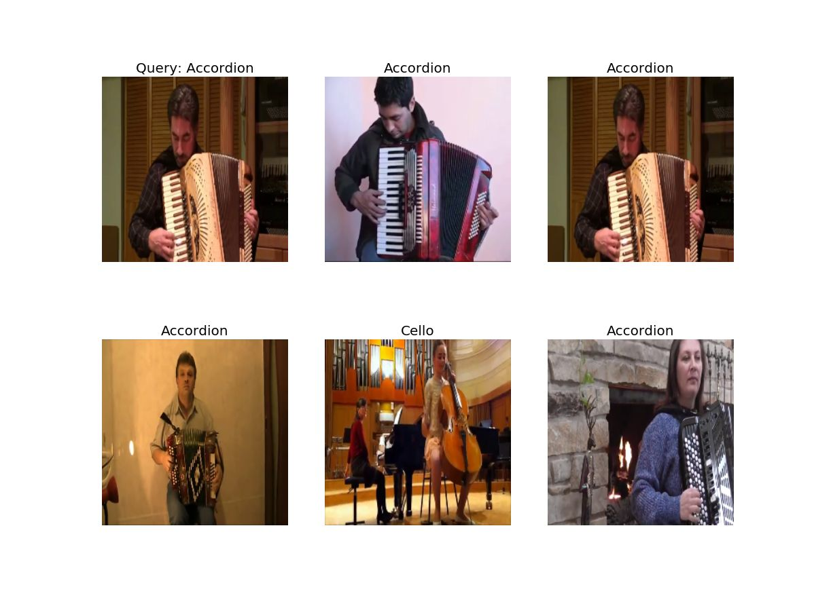
<audio src="./assets/sounds/4.wav" controls preload></audio>
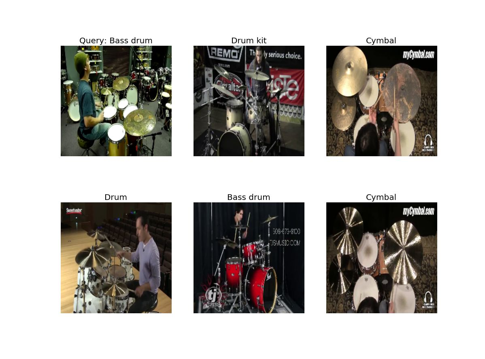
<audio src="./assets/sounds/5.wav" controls preload></audio>
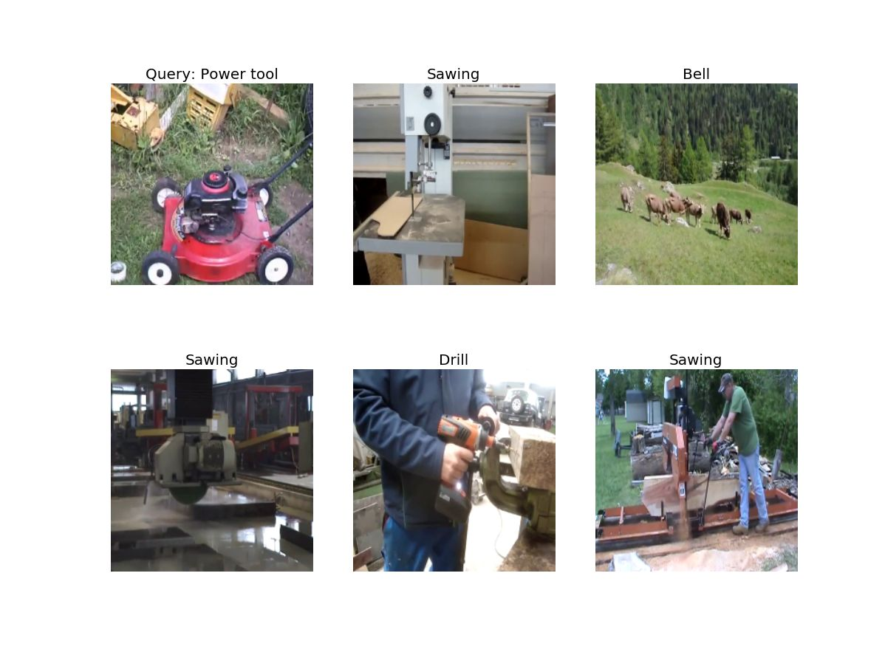
<audio src="./assets/sounds/6.wav" controls preload></audio>
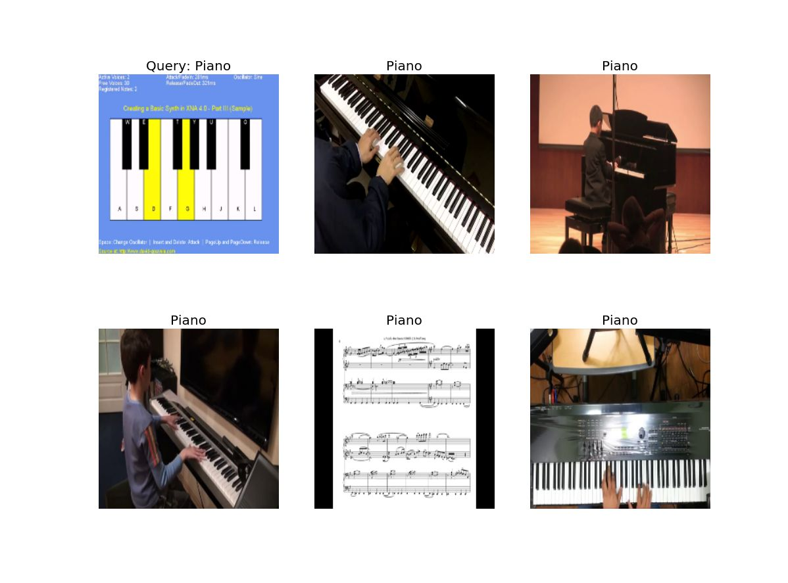
<audio src="./assets/sounds/7.wav" controls preload></audio>
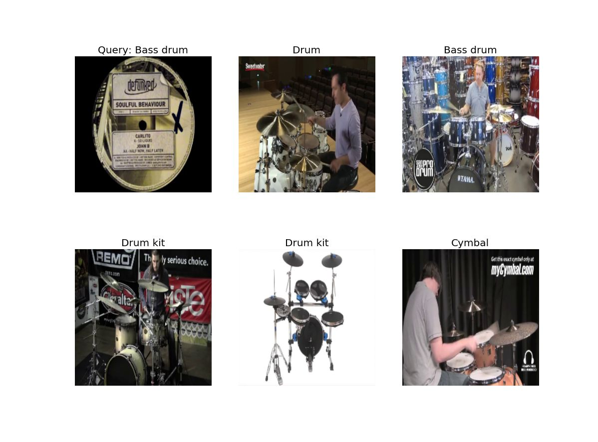
<audio src="./assets/sounds/8.wav" controls preload></audio>
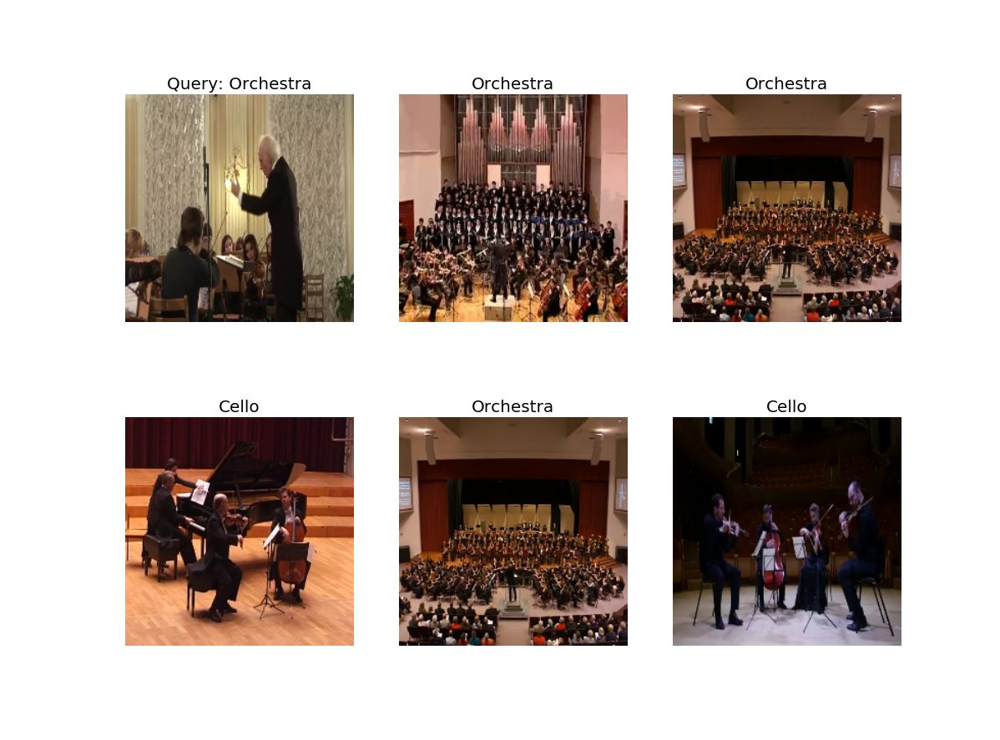
<audio src="./assets/sounds/9.wav" controls preload></audio>

#### To-Do
- [ ] Include more results
- [ ] Include other two types of queries (image-2-audio and audio-2-audio)
- [ ] Work on localization
- [ ] Upload trained models
- [ ] Improve documentation

Feel free to report bugs and improve the code by submitting a PR. 
